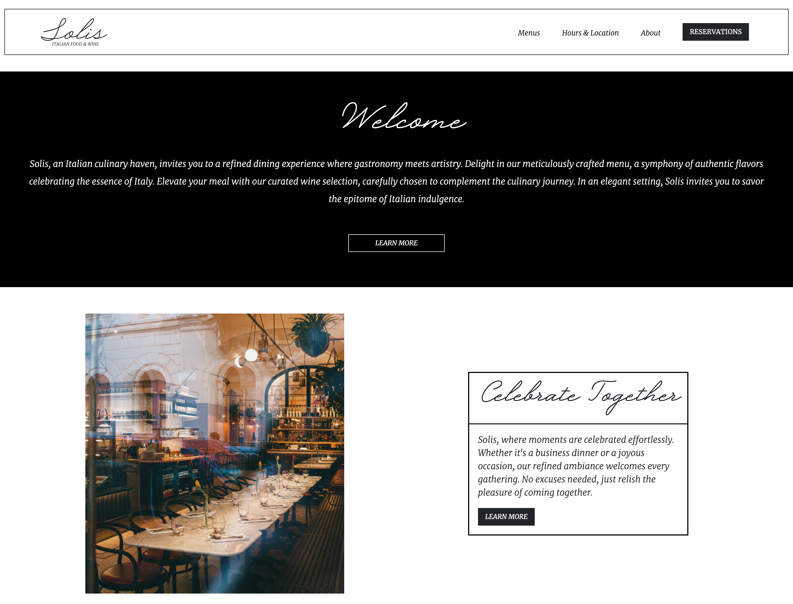

# Welcome to Solis Italian Food & Wine 🍝

## Description 📜
Welcome to Solis Italian Food and Wine, where elegance meets exclusivity. Explore our authentic Italian cuisine, curated wine selection, and refined ambiance for an unforgettable dining experience. Buon appetito! 🍝🍷🏞️

[👉 Explore the live website ](https://solis-italian-food-and-wine.netlify.app/home)

## Technologies Used 🛠️

- HTML, CSS, and JavaScript for the front-end user interface.
- React.js as the front-end library for dynamic rendering.
- React Bootstrap: A UI framework that integrates Bootstrap styles and components into React applications, providing a responsive and visually appealing user interface.

Feel free to explore the project and contribute to make it even more amazing! 😊🚀
